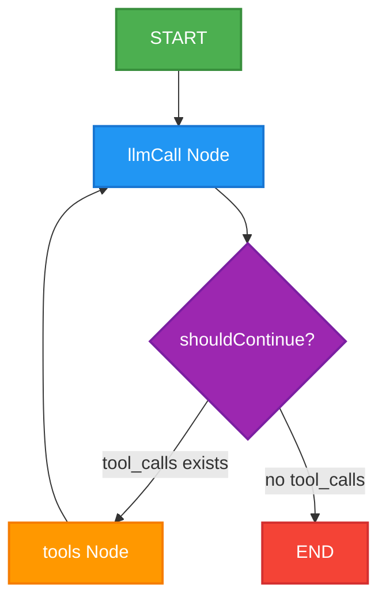

# 🚀 LangGraph Stateful AI Agent with Groq & LangSmith

A blazingly fast, stateful, cyclic AI agent built with **LangGraph**, **Node.js (ESM)**, and **Groq (`llama-3.3-70b-versatile`)**. The agent is equipped with dynamic mathematical tools and fully optimized for lightweight prompt token consumption and real-time execution tracing with **LangSmith**.

---

## 🗺️ Agent Architecture

This agent uses a **StateGraph** with conditional routing to dynamically determine whether to invoke computational tools or formulate a direct answer.



---

## ✨ Features

* **Stateful Cyclic Workflow**: Built using LangGraph's `StateGraph` and `MessagesAnnotation` to preserve clean context across recursive executions.
* **Lightning-Fast Inference**: Uses the high-performance Groq LLaMA 3.3 70B model for near-instant decisions.
* **Token-Optimized Schema**: Zod tool schemas and system prompts are streamlined to minimize prompt token footprint (saving **~8%** on token overhead).
* **LangSmith Tracing**: Zero-config visual execution debugging just by adding your LangSmith API keys to the environment.
* **Node.js ESM Compatibility**: Fully configured for ES Modules and polyfilled for Web Crypto API compatibility in Node v18+.

---

## 🛠️ Tech Stack

* **Orchestration**: `@langchain/langgraph`
* **Agent Core & Message Schema**: `@langchain/core`
* **Inference**: `@langchain/groq` (Groq SDK)
* **Schema Validation**: `zod`
* **Environment Configuration**: `dotenv`

---

## 🚀 Getting Started

### 1. Prerequisites
* **Node.js** v18.19.1 or higher installed on your system.

### 2. Installation
Clone this repository and install the dependencies:
```bash
npm install
```

### 3. Setup Environment Variables
Create a `.env` file in the root directory (or update your existing one) and populate it with your credentials:

```env
# Groq LLM Key
GROQ_API_KEY=your_groq_api_key_here

# LangSmith Tracing Configuration
LANGCHAIN_TRACING_V2=true
LANGCHAIN_API_KEY=your_langsmith_api_key_here
LANGCHAIN_PROJECT="lang-graph-demo"
```

### 4. Run the Agent
Run the main script to initiate the agent and watch it call the tools:
```bash
node index.js
```

---

## ⚡ Performance Optimization details

To keep execution costs minimal, the prompt structure has been heavily optimized:
1. **Simplified Parameters**: Removed `.describe(...)` wrappers from mathematical parameters where semantic intent was already obvious, shrinking the injected JSON schemas.
2. **Minimalist System Prompt**: Condensed the system instructions to `"Concise math helper."`, saving crucial prompt tokens on every loop turn.
